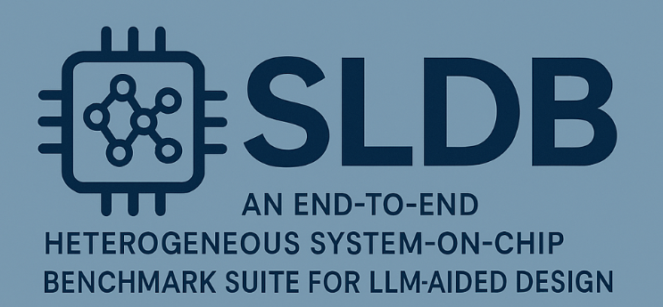

# 

## Overview

The **System-Level Design Benchmark (SLDB)** is a comprehensive benchmark suite tailored to evaluate Large Language Models (LLMs) performance in system-level integration and configuration tasks for heterogeneous System-on-Chip (SoC) designs. Developed to bridge the gap between component-level benchmarks and realistic SoC scenarios, SLDB enables researchers and practitioners to assess the capabilities of LLMs in system-level design tasks.  
<br>  


---

## Key Features

- **10 Baseline Heterogeneous SoC Designs**  
  Each design integrates accelerators from various application domains (cryptography, deep learning, image processing) into a baseline 2x2 tile ESP architecture.

- **Synthetic Library**  
  Combines baseline accelerators into various configurations.

- **Complete Integration Environment**  
  Full integration and configuration files, DMA wrapper templates, testing application code (baremetal and Linux-compatible).

- **Evaluation Metrics**  
  Enables functional correctness assessments through detailed accelerator processing stages (Configuration, Load, Compute, Store).

---

## Accelerator Designs Included

| Accelerator    | Domain           | Description                          | Code Length | Source   |
|----------------|------------------|--------------------------------------|-------------|----------|
| AES Encryption | Cryptography     | AES encryption algorithm             | 13,736      | RTL-Repo |
| AES Decryption | Cryptography     | AES decryption algorithm             | 37,658      | RTL-Repo |
| SHA-256        | Cryptography     | SHA-256 hashing algorithm            | 13,343      | RTL-Repo |
| SOBEL          | Image Processing | Edge detection filter                | 1,951       | RTL-Repo |
| FFT            | Image Processing | 64-point, 9-stage FFT                | 200,911     | RTL-Repo |
| FCDNN          | Deep Learning    | 6-layer DNN with sigmoid activation  | 33,163      | RTL-Repo |
| LSTM           | Deep Learning    | Long Short-Term Memory layer         | 69,138      | Koios    |
| SIMPLEDNN      | Deep Learning    | 7-layer DNN with relu activation     | 15,420      | RTL-Repo |
| SPMV           | Deep Learning    | Sparse Matrix-Vector multiplication  | 111,074     | Koios    |
| CONVOLUTION    | Deep Learning    | 3-layer convolutional neural network | 8,937       | RTL-Repo |

---

## Quick Start

### Requirements

- ESP Framework ([https://www.esp.cs.columbia.edu](https://www.esp.cs.columbia.edu))
- ModelSim DE 2023.2
- Vivado 2023.2

---

### Installation

Clone the repository:

```bash
git clone https://github.com/sld-columbia/sldb.git
```

Navigate to the directory:

```bash
cd SLDB
```

---

### Retrieving the Third Party Accelerators

For the RTL-Repo accelerators:

1.  
   ```bash
   python3 get_rtl_repo_acc.py
   ```

2.  
   ```bash
   python3 choose_acc_files.py
   ```

3. Rename the top module of each accelerator to the accelerator name you used for SoC generation.

---

### SoC Generation

1. **Select Accelerator**: Choose an accelerator from the provided list.

2. **Configure SoC**:

   ```bash
   cd esp; ./tools/accgen/accgen.sh
   ```

   Complete the SoC configurations using the values in:

   ```
   integrated_acc/$ACCNAME/soc_gen/$ACCNAME_accgen.txt
   ```

   You may use a different accelerator name; just ensure that the top module of your accelerator is named identically.

---

### Running a Benchmark

1. **Add third-party RTL to the ESP SoC**  
   After SoC generation is complete, you should see:

   ```
   esp/accelerators/rtl/$ACCNAME_rtl/
   ```

   Copy the contents of:

   ```
   selected_accelerator_files/$ACCNAME/
   ```

   into:

   ```
   esp/accelerators/rtl/$ACCNAME_rtl/hw/src/$ACCNAME_rtl_basic_dma64/
   ```

   Make sure the SoC configuration matches the file from the earlier step, otherwise compatibility issues may occur.

2. **Add the SLDB wrappers to the ESP SoCs**  
   Copy:

   ```
   SLDB_wrappers/$ACCNAME_rtl_basic_dma64.v
   ```

   into:

   ```
   esp/accelerators/rtl/$ACCNAME_rtl/src/$ACCNAME_rtl_basic_dma64/
   ```

3. **Generating a Bitstream**

   ```bash
   make $ACCNAME_rtl-hls
   ```

   ```bash
   make esp-xconfig
   ```

   <em>For baseline SoCs:</em>  
   - Keep default configurations  
   - Add the accelerator  
   - Ensure the selected processor is **Ariane**

   <em>For synthetic SoCs:</em>  
   - Use nxn tiles  
   - Only one IO tile per SoC  
   - Mix accelerators/components as needed

   Run:
   ```bash
   make $ACCNAME_rtl-baremetal
   ```

   For simulation:

   ```bash
   TEST_PROGRAM=./soft-build/ariane/baremetal/$ACCNAME_rtl.exe make sim-gui
   ```

   For synthesis:

   ```bash
   make vivado-syn
   ```

---

## Evaluation Metrics

Functional correctness is assessed through simulation against accelerator processing stages:

- **Configuration Stage**: Correct configuration parameters initialization  
- **Load Stage**: Correct handling of DMA data loading  
- **Compute Stage**: Proper computation and signal-port mappings  
- **Store Stage**: Successful DMA data storage back to memory

---

## Citation

If you use the SLDB benchmark suite in your research, please cite our paper.  
BibTeX citation will be available upon release of the proceedings.

---

## Benchmark Release Status

⚠️ **SLDB is currently under active development.**  
We are in the process of finalizing the initial benchmark release. You may encounter minor issues or changes as the repository evolves.

We welcome your feedback and contributions!  
If you encounter any bugs, inconsistencies, or integration issues, please [open an issue](https://github.com/sld-columbia/sldb/issues) on the GitHub repository so we can address them promptly.

---
---

## Contributing

We welcome extensions to the benchmark.
Feel free to submit pull requests and issues to help enhance SLDB.

---

## License

SLDB is released under the **Apache 2.0 License**.  
See the [LICENSE](LICENSE) file for details.

---
